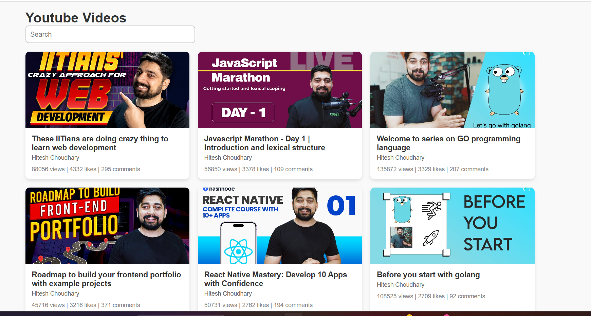

# YouTube Video Fetcher 🎥

This project fetches and displays YouTube videos based on a search query using the FreeAPI YouTube API. Users can view video thumbnails, titles, channel names, and engagement stats (views, likes, and comments). A search feature is also included for filtering videos.

## Features 🚀
- Fetches and displays the most liked YouTube videos on JavaScript.
- Displays video title, channel name, views, likes, and comments.
- Clickable video cards redirect to YouTube.
- Search functionality to filter videos by title or channel.
- Responsive design with smooth hover effects.

## Technologies Used 🛠️
- **HTML**: Structure the webpage.
- **CSS**: Styling for video cards and responsiveness.
- **JavaScript (ES6+)**: Fetch API, DOM Manipulation.
## Deployment Link 
https://youtube-video-fetcher.vercel.app/
## Repository URl
https://github.com/Rocky4512/youtube-video-fetcher

## Installation & Usage 📥
1. Clone the repository:
   ```bash
   git clone https://github.com/your-username/your-repository.git
   ```
2. Open `index.html` in your browser.

## API Used 🌐
- [FreeAPI YouTube API](https://freeapi.app/) (Endpoint: `https://api.freeapi.app/api/v1/public/youtube/videos`)

## Folder Structure 📂
```
📁 project-root
│-- 📄 index.html        # Main HTML file
│-- 📄 styles.css        # Styles for UI
│-- 📄 script.js         # JavaScript for fetching and displaying videos
│-- 📄 README.md         # Documentation
```

## How It Works 🔧
1. Fetches YouTube videos from the API.
2. Dynamically creates and displays video cards.
3. Users can search and filter videos.
4. Clicking a video redirects to YouTube.

## Screenshots 📸
 *(Add a screenshot of the project here)*

## Future Enhancements 🚀
- Add pagination to load more videos.
- Include additional video details.
- Implement dark mode.

## Contributing 🤝
Feel free to fork the repository and submit pull requests. 

## License 📜
This project is open-source under the MIT License.

---
💡 **Have suggestions?** Feel free to raise an issue!!